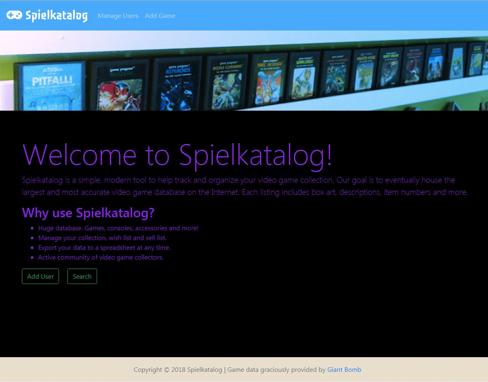
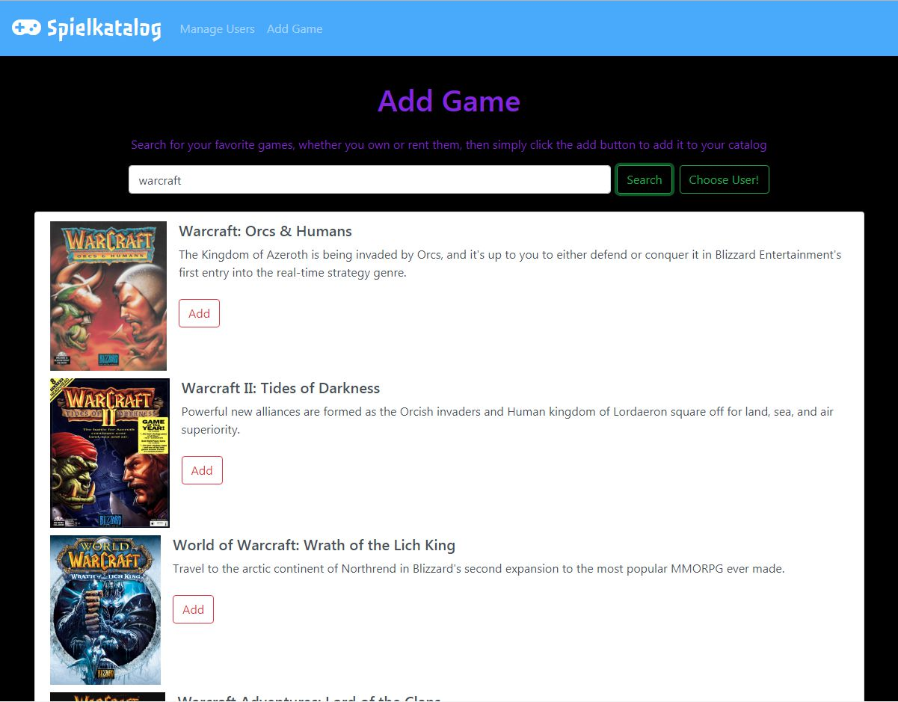
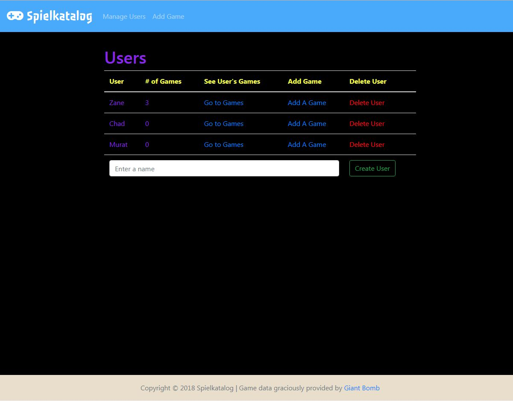
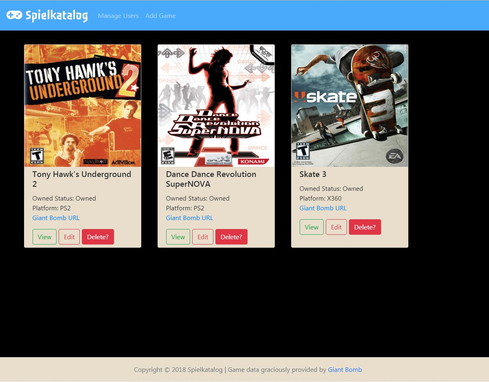

# Spielkatalog

[Link to Spielkatalog on Heroku](http://spielkatalog.herokuapp.com)

Spielkatalog is a simple, modern tool to help track and organize your video game collection.

## Screenshots

### Homepage
* Explanation about the site along with links to User and Game Search pages

### Add Game Page
* Allows users to add using a search function to find the games they own, borrow, or want to buy

### Add User Page
* Allows users to be added to the database for future cataloging

### User Catalog Page
* Allows users to see all the games they currently have in their catalog

## Built With

* html, css, javascript, jquery, ajax, bootstrap, handlebars, node, mysql, giantBomb API
* npm packages: body-parser, dotenv, express, express-handlebars, giantbomb, mysql2, sequelize

## Authors

* **Chad Balash** - [Profile](https://github.com/chad-balash)
* **Zane Neuschuler** - [Profile](https://github.com/zaneneuschuler)
* **Murat Tartan** - [Profile](https://github.com/mtartan)
* **Chris Welter** - [Profile](https://github.com/xryswelter)

## Acknowledgments

* [GiantBomb.com](https://www.giantbomb.com/api/)
